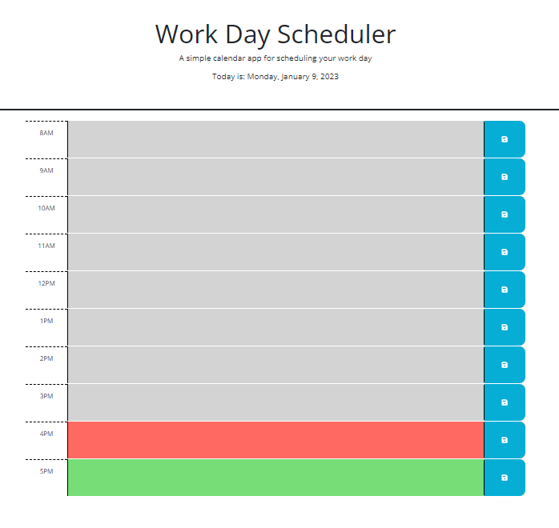

# Doms-Workday-Scheduler

## Purpose 

A web-based tool built to help with scheduling one's day Built for UCF Coding Bootcamp Challenge 5

The current date will appear at the top of the page for your reference and convenience. For each hour of the work day you can click and add tasks that you need to complete. By clicking the save button your tasks will be saved locally. Upon any closing or refreshing of the site, the previously saved tasks will be loaded onto the page. You can update existing tasks by clicking on them and re-saving them with the save button.

Each hour will be colored depending on if that hour is in the past (grey), future (green), or is the current hour (red).

## Built With

HTML/
CSS/
Javascript/
jquery API/
bootstrap API/

## Deployment

website: https://domspadafora.github.io/5-Doms-Workday-Scheduler/

repository: https://github.com/DomSpadafora/5-Doms-Workday-Scheduler.git

- - -
© 2022 edX Boot Camps LLC. Confidential and Proprietary. All Rights Reserved.
